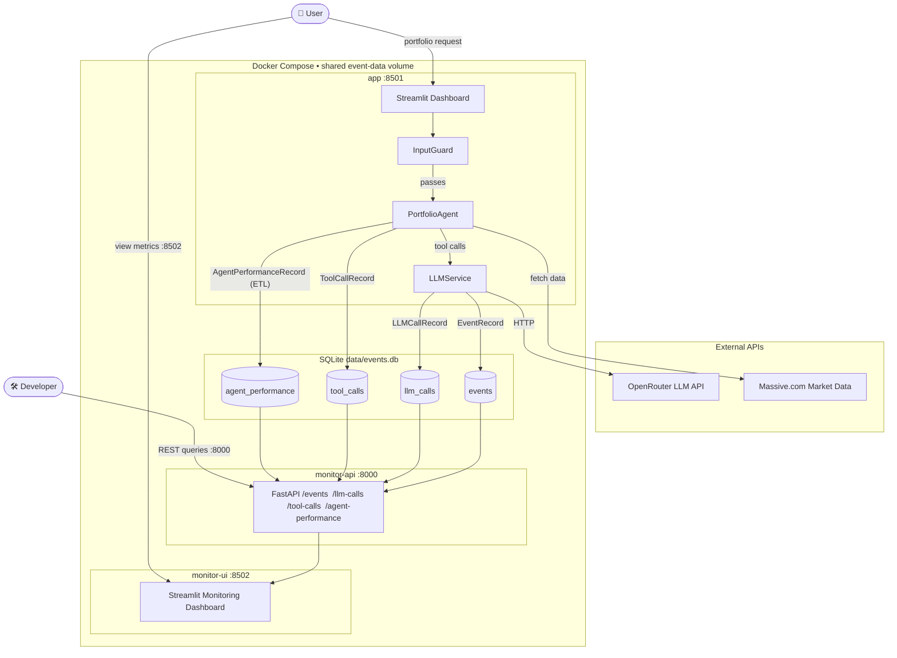
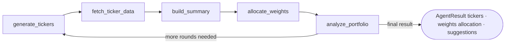

# Portfolio Builder Agent

## Overview

A Streamlit app that uses a **tool-calling LLM agent** to build personalized US equity portfolios. Users describe investment goals in natural language; the agent fetches market data via [Massive.com](https://massive.com), runs analysis through [OpenRouter](https://openrouter.ai)-hosted models, and returns a weighted portfolio with actionable suggestions.

A built-in **monitoring stack** records every LLM call, tool invocation, and agent run to a structured SQLite database, exposing the data through a REST API and a dedicated Streamlit dashboard.

## Features

- **Natural-language portfolio creation** — describe preferences and constraints in plain English.
- **Live market data** — historical prices fetched per ticker with in-chat progress and graceful fallbacks for missing symbols.
- **Switchable LLM models** — choose the active model from the sidebar; options configured in [config.yml](config.yml).
- **Backtesting** — Applies filters and quantitative analysis to the generated portfolio.
- **Tabbed dashboard** — Chat, Historical Prices, and Portfolio views with a post-analysis prompt to review results.
- **Structured monitoring** — Every LLM round-trip, tool call, and completed run is persisted to dedicated SQLite tables.
- **Monitoring REST API** — Query live data over HTTP with Swagger UI at `/docs` (port 8000).
- **Monitoring dashboard** — Separate Streamlit UI with filterable dataframes and summary metrics (port 8502).

## System Architecture



## Agent Design

A single `PortfolioAgent` runs an iterative **tool loop**, calling five tools in sequence:



The final output is a structured `AgentResult` containing tickers, weights, allocation, analysis text, and suggestions (`add / remove / reweight`).

**Key internals:**
- **Tool-loop execution** — `run()` seeds context, iterates `_run_loop()`, and persists each tool call/result to an event store.
- **Caching** — `TickrDataManager` caches per-ticker payloads; `TickrSummaryManager` caches summaries keyed by ticker set and cache version.
- **Output normalization** — missing fields are backfilled from tool state; suggestions are coerced into a consistent shape.

## Monitoring

### Event Store tables

The SQLite database (`data/events.db`) contains four tables written automatically during every agent run:

| Table | Written by | One row per |
|---|---|---|
| `events` | All components | Every legacy event (LLM request, tool call, guard check, …) |
| `llm_calls` | `LLMService` | LLM HTTP round-trip |
| `tool_calls` | `PortfolioAgent` | Tool invocation inside the agent loop |
| `agent_performance` | ETL (`src/etl/agent_performance.py`) | Completed agent run (aggregated) |

### Monitoring REST API (`monitor-api`, port 8000)

A FastAPI application (`src/monitoring_api.py`) exposes read-only query endpoints for each table:

| Endpoint | Filters |
|---|---|
| `GET /health` | — |
| `GET /events` | `session_id`, `event_type`, `limit` |
| `GET /llm-calls` | `session_id`, `run_id`, `stage`, `limit` |
| `GET /tool-calls` | `session_id`, `run_id`, `tool_name`, `limit` |
| `GET /agent-performance` | `session_id`, `run_id`, `status`, `limit` |

Interactive Swagger UI: `http://localhost:8000/docs`

```bash
# Examples
curl "http://localhost:8000/agent-performance?limit=10"
curl "http://localhost:8000/llm-calls?session_id=abc123"
curl "http://localhost:8000/tool-calls?tool_name=generate_tickers"
```

### Monitoring Dashboard (`monitor-ui`, port 8502)

A dedicated Streamlit app (`monitoring.py`) provides:
- **Four tabs** — one per table, each rendered as an interactive dataframe.
- **Summary metrics** — avg latency, call counts, token totals, status breakdown.
- **Tool usage chart** — bar chart of tool invocation frequency.
- **Sidebar filters** — filter by `session_id`, `run_id`, and row limit; one-click data refresh.
- **API link** — direct link to the REST API docs from the sidebar.

Open at `http://localhost:8502` after starting the stack.

## Project Structure
```
portfolio-builder-agent/
│
├── docs/                    # Documentation files
├── config.yml               # Application configuration
├── docker-compose.yml       # Docker Compose services
├── .secrets.example         # Template for .secrets (gitignored)
├── main.py                  # Main Streamlit app entry point
├── monitoring.py            # Monitoring Streamlit dashboard (port 8502)
├── pyproject.toml           # Poetry configuration file
├── src/
│   ├── config.py            # Configuration loading
│   ├── dashboard.py         # Main Streamlit dashboard UI
│   ├── data_client.py       # Massive.com (Polygon.io) data fetching
│   ├── llm_service.py       # OpenRouter LLM client (emits LLMCallRecord)
│   ├── llm_validation.py    # LLM output validation
│   ├── monitoring_api.py    # FastAPI monitoring REST API (port 8000)
│   ├── plots.py             # Plotly chart builders
│   ├── portfolio.py         # Portfolio allocation
│   ├── summaries.py         # Data summarization
│   ├── agent.py             # PortfolioAgent (emits ToolCallRecord)
│   ├── etl/
│   │   └── agent_performance.py  # Aggregates llm_calls + tool_calls → agent_performance
│   └── event_store/
│       ├── base.py          # EventStore / MonitoringStore protocols
│       ├── models.py        # EventRecord, LLMCallRecord, ToolCallRecord, AgentPerformanceRecord
│       ├── sqlite_store.py  # SQLite backend (all four tables)
│       ├── buffer.py        # Buffered wrapper
│       └── postgres_store.py
├── tests/                   # Test suite
└── README.md                # Project overview and instructions
```

## Getting Started

### Prerequisites
- Python 3.11 or higher
- pip (Python package manager)

### Installation
1. Clone the repository:
   ```bash
   git clone <repository-url>
   cd portfolio-builder-agent
   ```
2. Install dependencies:
   ```bash
   poetry install
   ```

### Running the Application
To start the main Streamlit dashboard, run:
```bash
poetry run streamlit run main.py
```

To start the monitoring API and dashboard locally:
```bash
# Monitoring REST API
poetry run uvicorn src.monitoring_api:app --host 0.0.0.0 --port 8000

# Monitoring Streamlit dashboard
poetry run streamlit run monitoring.py --server.port 8502
```

## Configuration and Secrets
- Update [config.yml](config.yml) for model, prompts, and UI text.
- API keys are supplied as **environment variables** at runtime.

### Setting up secrets
Copy the example file and fill in your keys:
```bash
cp .secrets.example .secrets
```
Edit `.secrets`:
```
OPENROUTER_API_KEY=your_openrouter_key_here
MASSIVE_API_KEY=your_massive_com_key_here
```
> `.secrets` is git-ignored.

**Locally (shell):**
```bash
export OPENROUTER_API_KEY="your_openrouter_key_here"
export MASSIVE_API_KEY="your_massive_com_key_here"
poetry run streamlit run main.py
```

**Docker Compose (recommended):**
```bash
docker compose up # reads .secrets automatically
```

**Docker CLI (env-file):**
```bash
docker run -p 8501:8501 --env-file .secrets portfolio-builder-agent
```

### Massive.com (Polygon.io) Setup
- **API key**: Sign up at [massive.com](https://massive.com) and obtain an API key.
- **Plan requirement**: The **Advanced plan ($199/mo)** is required for financial statement data (income statement, balance sheet). OHLCV price data is available on the free tier.
- The API key is loaded from the environment variable specified in `massive.api.key_env_var` (default: `MASSIVE_API_KEY`).
- Python SDK: `massive` (PyPI) — `pip install -U massive`

### OpenRouter Model Setup
- The app uses one active agent model configured under `agent.model` in [config.yml](config.yml).
- Users can switch to any configured option in `openrouter.model_choices` from the sidebar selector.
- OpenRouter settings are grouped under `openrouter.api` and `openrouter.model_choices` in [config.yml](config.yml).
- Set the API key via environment variable name specified in `openrouter.api.key_env_var` (default: `OPENROUTER_API_KEY`).

## Using Docker

### Build the Docker Image
```bash
docker build -t portfolio-builder-agent .
```

### Run with Docker Compose (recommended)

```bash
# Start everything — main app, monitoring API, and monitoring dashboard
docker compose up --build
```

| Service | URL | Description |
|---|---|---|
| `app` | http://localhost:8501 | Main portfolio builder UI |
| `monitor-api` | http://localhost:8000 | Monitoring REST API + Swagger UI (`/docs`) |
| `monitor-ui` | http://localhost:8502 | Monitoring Streamlit dashboard |

```bash
# Start only the monitoring services (no API keys needed)
docker compose up --build monitor-api monitor-ui

# Run tests
docker compose run --build --rm test
```

All three services share the same `event-data` Docker volume, so data written by the main app is immediately visible in the monitoring stack.

### Run with Docker CLI
```bash
# App mode
docker run -p 8501:8501 --env-file .secrets portfolio-builder-agent

# Test mode
docker run --rm portfolio-builder-agent pytest -v --tb=short
```

### Full rebuild cycle
```bash
docker compose build
docker compose run --rm test
docker compose up
```

## Code Standards
This project follows:
- **PEP8**: Python style guide.
- **SOLID Principles**: For maintainable and scalable code.

## Contributing
Contributions are welcome! Please follow the code standards and submit a pull request.

## License
This project is licensed under the MIT License.