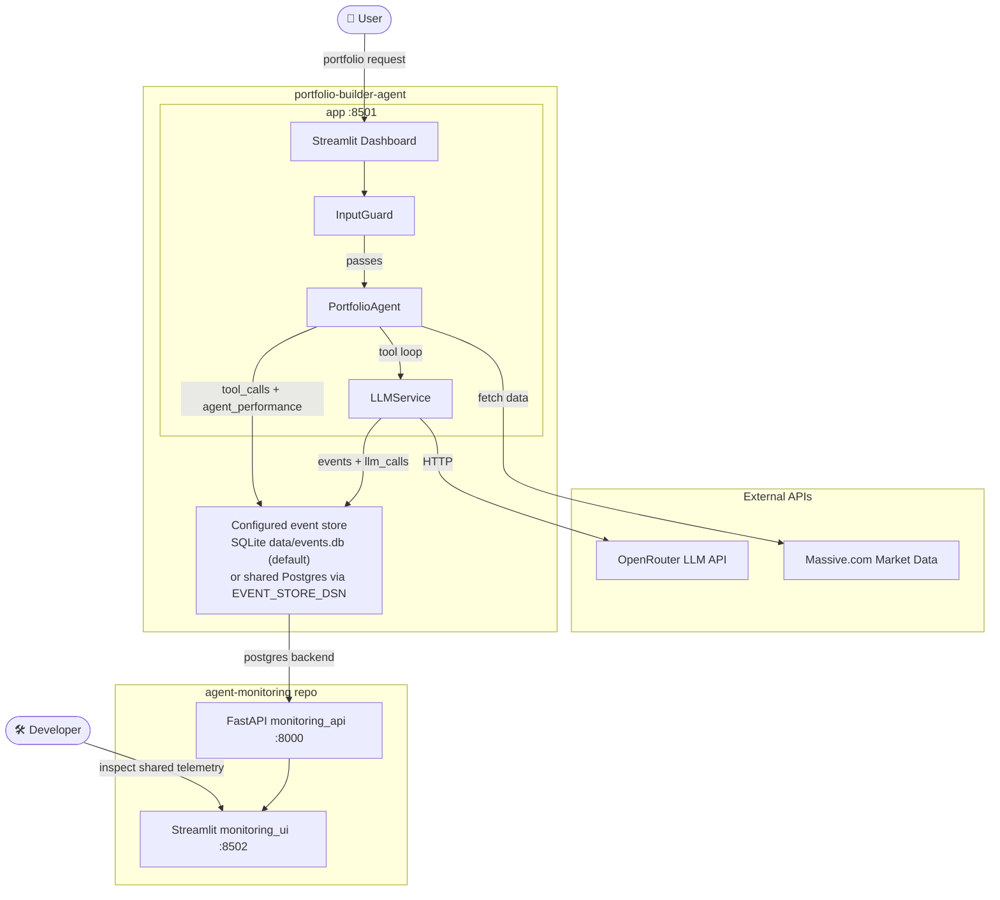
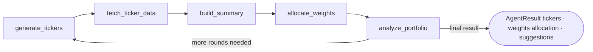

# Portfolio Builder Agent

## Overview

A Streamlit app that uses a **tool-calling LLM agent** to build personalized US equity portfolios. Users describe investment goals in natural language; the agent fetches market data via [Massive.com](https://massive.com), runs analysis through [OpenRouter](https://openrouter.ai)-hosted models, and returns a weighted portfolio with actionable suggestions.

The app emits structured telemetry for every LLM call, tool invocation, and completed run. Shared monitoring services now live in the sibling `agent-monitoring` repo, while this repo focuses on the product UI and telemetry production.

## Features

- **Natural-language portfolio creation** — describe preferences and constraints in plain English.
- **Live market data** — historical prices fetched per ticker with in-chat progress and graceful fallbacks for missing symbols.
- **Switchable LLM models** — choose the active model from the sidebar; options configured in [config.yml](config.yml).
- **Backtesting** — Applies filters and quantitative analysis to the generated portfolio.
- **Tabbed dashboard** — Chat, Historical Prices, and Portfolio views with a post-analysis prompt to review results.
- **Structured telemetry** — Every LLM round-trip, tool call, and completed run is persisted to dedicated event-store records.
- **Shared monitoring integration** — Switch the backend to Postgres and inspect both apps through the sibling `agent-monitoring` API and dashboard.

## System Architecture


```mermaid
flowchart TD
    User(["👤 User"])
    Dev(["🛠️ Developer"])

    subgraph External["External APIs"]
        OR["OpenRouter LLM API"]
        MC["Massive.com Market Data"]
    end

    subgraph PortfolioRepo["portfolio-builder-agent"]
        subgraph AppSvc["app  :8501"]
            UI["Streamlit Dashboard"]
            Guard["InputGuard"]
            Agent["PortfolioAgent"]
            LLM["LLMService"]
        end

        Store["Configured event store\nSQLite data/events.db (default)\nor shared Postgres via EVENT_STORE_DSN"]
    end

    subgraph MonitoringRepo["agent-monitoring repo"]
        API["FastAPI monitoring_api  :8000"]
        MUI["Streamlit monitoring_ui  :8502"]
    end

    User -- "portfolio request" --> UI
    UI --> Guard
    Guard -- "passes" --> Agent
    Agent -- "tool loop" --> LLM
    LLM -- "HTTP" --> OR
    Agent -- "fetch data" --> MC

    LLM -- "events + llm_calls" --> Store
    Agent -- "tool_calls + agent_performance" --> Store

    Store -- "postgres backend" --> API
    API --> MUI
    Dev -- "inspect shared telemetry" --> MUI
```

## Agent Design

A single `PortfolioAgent` runs an iterative **tool loop**, calling five tools in sequence:


```mermaid
flowchart LR
    A["generate_tickers"] --> B["fetch_ticker_data"]
    B --> C["build_summary"]
    C --> D["allocate_weights"]
    D --> E["analyze_portfolio"]
    E -->|"more rounds needed"| A
    E -->|"final result"| R(["AgentResult tickers · weights allocation · suggestions"])
```

The final output is a structured `AgentResult` containing tickers, weights, allocation, analysis text, and suggestions (`add / remove / reweight`).

**Key internals:**
- **Tool-loop execution** — `run()` seeds context, iterates `_run_loop()`, and persists each tool call/result to an event store.
- **Caching** — `TickrDataManager` caches per-ticker payloads; `TickrSummaryManager` caches summaries keyed by ticker set and cache version.
- **Output normalization** — missing fields are backfilled from tool state; suggestions are coerced into a consistent shape.

## Telemetry and Monitoring

### Event store records

The app emits four logical record types during every agent run. With `event_store.backend: "sqlite"` they are stored locally in `data/events.db`. With `event_store.backend: "postgres"` they are written to the shared Postgres schema used by the sibling `agent-monitoring` repo.

| Record / Table | Written by | One row per |
|---|---|---|
| `events` | All components | Legacy event envelope (LLM request, tool call, guard check, …) |
| `llm_calls` | `LLMService` | LLM HTTP round-trip |
| `tool_calls` | `PortfolioAgent` | Tool invocation inside the agent loop |
| `agent_performance` | Shared ETL in `agent-monitoring` | Completed agent run aggregated from LLM and tool records |

### Shared monitoring services

This repo no longer owns the monitoring API or admin dashboard. Those services live in the sibling `agent-monitoring` repo:

- `agent_monitoring.monitoring_api` exposes the shared FastAPI read API over Postgres.
- `agent_monitoring.monitoring_ui` provides the Streamlit admin dashboard for both `portfolio-builder-agent` and `spectrum-news-agent`.

To use centralized monitoring locally:

```bash
# 1. Set event_store.backend to postgres in config.yml.
# 2. Export EVENT_STORE_DSN for the shared database.
# 3. Start the shared monitoring stack from the sibling repo.
cd ../agent-monitoring
docker compose up --build monitoring-api monitoring-ui
```

## Project Structure
```
portfolio-builder-agent/
│
├── docs/                    # Documentation files
├── config.yml               # Application configuration
├── docker-compose.yml       # Docker Compose services
├── .secrets.example         # Template for .secrets (gitignored)
├── main.py                  # Main Streamlit app entry point
├── pyproject.toml           # Poetry configuration file
├── src/
│   ├── config.py            # Configuration loading
│   ├── dashboard.py         # Main Streamlit dashboard UI
│   ├── data_client.py       # Massive.com (Polygon.io) data fetching
│   ├── llm_service.py       # OpenRouter LLM client (emits LLMCallRecord)
│   ├── llm_validation.py    # LLM output validation
│   ├── plots.py             # Plotly chart builders
│   ├── portfolio.py         # Portfolio allocation
│   ├── summaries.py         # Data summarization
│   ├── agent.py             # PortfolioAgent (emits ToolCallRecord)
│   └── event_store/
│       ├── base.py          # EventStore / MonitoringStore protocols
│       ├── models.py        # EventRecord, LLMCallRecord, ToolCallRecord, AgentPerformanceRecord
│       ├── sqlite_store.py  # Local SQLite backend
│       ├── buffer.py        # Buffered wrapper
│       └── postgres_store.py # Adapter to shared agent-monitoring Postgres store
├── tests/                   # Test suite
└── README.md                # Project overview and instructions
```

Shared monitoring API/UI and the portfolio ETL live in the sibling `../agent-monitoring` repo.

## Getting Started

### Prerequisites
- Python 3.11 or higher
- pip (Python package manager)

### Installation
1. Clone the repository:
   ```bash
   git clone <repository-url>
   cd portfolio-builder-agent
   ```
2. Ensure the sibling `agent-monitoring` repo exists at `../agent-monitoring`.
3. Install dependencies:
   ```bash
   poetry install
   ```

### Running the Application
To start the main Streamlit dashboard, run:
```bash
poetry run streamlit run main.py
```

If you want the shared monitoring API and dashboard, run them from the sibling `agent-monitoring` repo after switching this app to the Postgres backend.

## Configuration and Secrets
- Update [config.yml](config.yml) for model, prompts, and UI text.
- API keys are supplied as **environment variables** at runtime.

### Setting up secrets
Copy the example file and fill in your keys:
```bash
cp .secrets.example .secrets
```
Edit `.secrets`:
```
OPENROUTER_API_KEY=your_openrouter_key_here
MASSIVE_API_KEY=your_massive_com_key_here
```
> `.secrets` is git-ignored.

**Locally (shell):**
```bash
export OPENROUTER_API_KEY="your_openrouter_key_here"
export MASSIVE_API_KEY="your_massive_com_key_here"
poetry run streamlit run main.py
```

**Docker Compose (recommended):**
```bash
docker compose up # reads .secrets automatically
```

**Docker CLI (env-file):**
```bash
docker run -p 8501:8501 --env-file .secrets portfolio-builder-agent
```

### Massive.com (Polygon.io) Setup
- **API key**: Sign up at [massive.com](https://massive.com) and obtain an API key.
- **Plan requirement**: The **Advanced plan ($199/mo)** is required for financial statement data (income statement, balance sheet). OHLCV price data is available on the free tier.
- The API key is loaded from the environment variable specified in `massive.api.key_env_var` (default: `MASSIVE_API_KEY`).
- Python SDK: `massive` (PyPI) — `pip install -U massive`

### OpenRouter Model Setup
- The app uses one active agent model configured under `agent.model` in [config.yml](config.yml).
- Users can switch to any configured option in `openrouter.model_choices` from the sidebar selector.
- OpenRouter settings are grouped under `openrouter.api` and `openrouter.model_choices` in [config.yml](config.yml).
- Set the API key via environment variable name specified in `openrouter.api.key_env_var` (default: `OPENROUTER_API_KEY`).

## Using Docker

### Build and run with Docker Compose (recommended)

The Dockerfile expects the sibling `agent-monitoring` repo as an additional build context, so Docker Compose is the simplest way to build and run this repo.

```bash
# Start the main portfolio app
docker compose up --build
```

| Service / Profile | URL | Description |
|---|---|---|
| `app` | http://localhost:8501 | Main portfolio builder UI |
| `test` | — | One-off pytest service |
| `lint` | — | One-off Ruff + mypy service |
| `event-db` (`postgres` profile) | — | Optional local Postgres for shared-backend testing |

```bash
# Run tests
docker compose run --build --rm test

# Run lint + type checks
docker compose run --build --rm lint

# Optional: start a local Postgres instance for EVENT_STORE_DSN-based testing
docker compose --profile postgres up -d event-db
```

When using the default SQLite backend, the app writes telemetry to the local `event-data` volume. Shared monitoring services are started from the sibling `agent-monitoring` repo.

### Standalone image build
```bash
docker buildx build --build-context agent_monitoring=../agent-monitoring -t portfolio-builder-agent .
```

### Run with Docker CLI
```bash
# App mode
docker run -p 8501:8501 --env-file .secrets portfolio-builder-agent

# Test mode
docker run --rm portfolio-builder-agent pytest -v --tb=short
```

### Full rebuild cycle
```bash
docker compose build
docker compose run --rm test
docker compose up
```

## Code Standards
This project follows:
- **PEP8**: Python style guide.
- **SOLID Principles**: For maintainable and scalable code.

## Contributing
Contributions are welcome! Please follow the code standards and submit a pull request.

## License
This project is licensed under the MIT License.